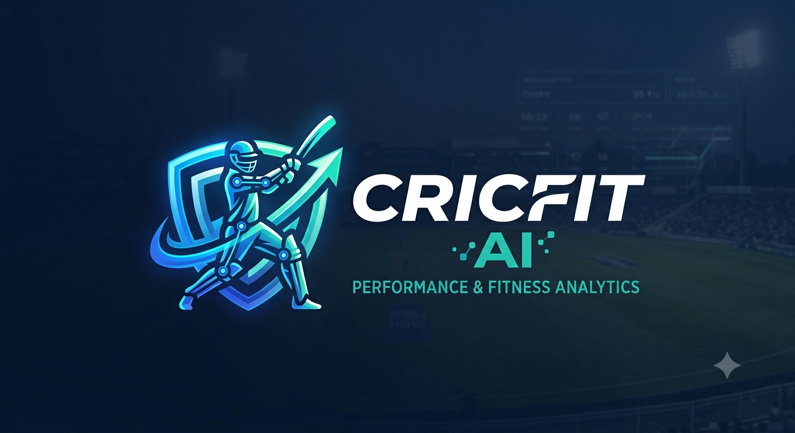

<div align="center">
  
  <h1>CricFit AI 🏏</h1>
  <p><em>AI-Powered Biomechanics & Fitness Analysis for Cricketers</em></p>
</div>

---

## 🌟 Overview

**CricFit AI** is an intelligent video-analysis platform that helps cricketers assess and improve their physical performance. Users log in, upload a **batting** or **bowling** video, and our AI pipeline analyzes body mechanics to generate a structured fitness report — covering balance, stability, flexibility, and more. Reports are stored in MongoDB and enriched by **Grok AI**, which turns raw metrics into actionable, motivating feedback. On repeat uploads, CricFit AI compares the new report against the user's history to track real improvement over time.

---

## ✨ Features

- **🎥 Video Upload & Analysis:** Users upload bowling or batting footage directly from the Streamlit frontend.
- **🤖 Custom Keras Models:** Separate deep-learning models trained specifically for batting and bowling action analysis.
- **🦴 Pose Estimation Engine:** Extracts body keypoints from video frames to power all biomechanical metrics.
- **📊 7-Point Fitness Report:** Every analysis scores the athlete across:
  - ⚖️ Balance
  - 🦵 Lower-body stability
  - 🧘 Flexibility / mobility
  - 💪 Core stability
  - ⚡ Agility
  - 🎯 Coordination
  - ↔️ Body symmetry
  - 🏃 Movement quality
- **🧠 Grok AI Coaching Layer:** Converts raw scores into personalized exercise recommendations and boosting/motivational messages.
- **📈 Progress Tracking:** On repeat uploads, current and historical reports are both sent to Grok AI to generate an improvement summary and updated fitness tips.
- **🏆 Bowling Action Match (Bowling-only):** Compares the user's bowling action against professional players (e.g. Jasprit Bumrah) and reports a closeness/match score, alongside improvement guidance.
- **🗄️ MongoDB Report History:** All reports are persisted per user, enabling longitudinal progress comparisons.

---

## 🛠️ Tech Stack

- **Frontend:** Streamlit (login, video upload, report display)
- **Backend:** Python, FastAPI
- **AI Models:** TensorFlow / Keras (custom-trained batting & bowling models, trained in Jupyter Notebook)
- **Pose Estimation:** MediaPipe
- **LLM Coaching:** Grok AI (exercise recommendations, improvement & boosting messages)
- **Database:** MongoDB (user auth, report storage, historical comparisons)
- **Computer Vision:** OpenCV

---

## 🚀 Getting Started

### Prerequisites
- Python 3.10+
- MongoDB (local or Atlas)
- Grok AI API Key

### Installation

1. **Clone the repository:**
   ```bash
   git clone https://github.com/<org>/CricFit-AI.git
   cd CricFit-AI
   ```

2. **Create and activate a virtual environment:**
   ```bash
   python -m venv venv
   # Windows
   venv\Scripts\activate
   # Linux/Mac
   source venv/bin/activate
   ```

3. **Install dependencies:**
   ```bash
   pip install -r requirements.txt
   ```

4. **Environment Variables:**
   Create a `.env` file based on `.env.example`:
   ```env
   GROK_API_KEY=your_key_here
   MONGODB_URI=your_mongodb_connection_string
   MODEL_PATH_BATTING=models/batting_model.h5
   MODEL_PATH_BOWLING=models/bowling_model.h5
   ```

5. **Run the FastAPI backend:**
   ```bash
   uvicorn main:app --host 0.0.0.0 --port 8000 --reload
   ```

6. **Run the Streamlit frontend:**
   ```bash
   streamlit run app.py
   ```

---

## 🔄 Analysis Workflow

```text
1. User logs in via Streamlit
2. User uploads batting/bowling video
3. Pose estimation extracts body keypoints frame-by-frame
4. Keras model (batting/bowling specific) scores the 7 fitness metrics
5. Report saved to MongoDB (linked to user)
6. Report sent to Grok AI → generates exercises + boosting message
7. [Bowling only] Action compared against pro player reference → match score
8. On next upload:
   → Previous + current report sent to Grok AI
   → Grok AI returns improvement summary + updated fitness tips
9. Final report returned to user via Streamlit
```

---

## 👥 Team

| Member                  | Responsibility                                              |
|--------------------------|--------------------------------------------------------------|
| Varshini                 | Frontend                                                     |
| Siva Dharshana            | Backend                                                       |
| Kavya                     | Frontend–Backend integration, dataset collection (batting)   |
| Mithun Maharajan K        | Batting model training (Keras)                                |
| Rakesh Kumar G             | Bowling model training (Keras)                                |
| Sudherson                 | Pose estimation calculation, dataset collection (bowling)     |

---

## 🔮 Future Improvements

- **🏏 Live Match Ball Prediction:** Predict live delivery outcomes in real time — bowler-favored (wicket, dot ball) vs batter-favored (four, six, run) — factoring in pitch conditions.
- **🏟️ Cricket Coaching Center Deployment:** Package CricFit AI as a B2B analysis tool for cricket coaching academies to track and train multiple athletes at scale.

---

<p align="center">Building better cricketers with AI and Biomechanics. 🏏⚙️</p>
